# 🧩 Projeto  – Diagrama de Atividades

### 📘 Contexto Geral

O sistema **Urna Eletrônica (UE)** foi desenvolvido como parte do projeto de **Modelagem de Software Orientada a Objetos (CC6522)**.
O sistema é composto por dois módulos principais:

* **UEg (Unidade Eleitoral de Gerenciamento):** responsável pela administração, cadastro e totalização dos votos.
* **UEv (Unidade Eleitoral Virtual):** responsável pela execução da votação, autenticação de eleitores e registro de votos.

O objetivo dos **diagramas de atividades** é representar de forma **visual e lógica** o **fluxo de execução das ações**, as **decisões** e os **pontos de interação** entre os atores (Administrador e Eleitor) e o sistema.

Cada diagrama está associado a um **caso de uso (UC)** definido previamente no projeto.

---

## 🧱 Estrutura do Projeto

| Módulo               | Descrição                             | Responsável   | Atores Principais |
| -------------------- | ------------------------------------- | ------------- | ----------------- |
| **UEg**              | Gerenciamento e controle do sistema   | Administrador | Administrador     |
| **UEv**              | Execução da votação                   | Eleitor       | Eleitor           |
| **Voto / Resultado** | Armazenamento e totalização dos votos | Sistema       | Administrador     |

---

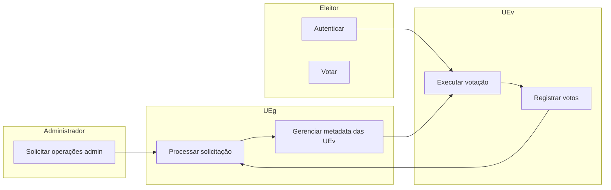

---

## UC_01 — Cadastrar UEv (Diagrama Completo)

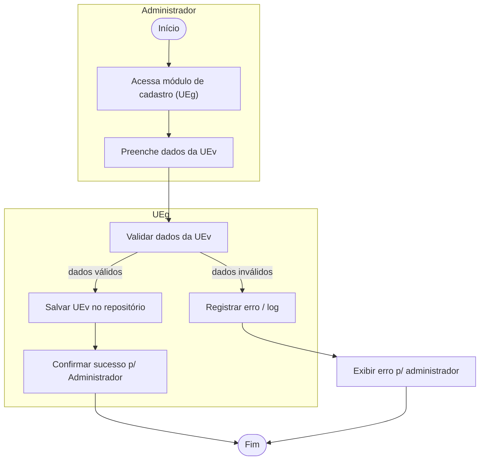
**Descrição:**

* O administrador acessa o módulo de cadastro no UEg.
* Insere os dados da nova unidade virtual (UEv).
* O sistema valida as informações e realiza o salvamento.
* Caso os dados estejam incorretos, uma mensagem de erro é exibida.

---

## UC_02 — Votar (Diagrama Completo com Swimlanes: Eleitor / UEv / Voto / UEg)

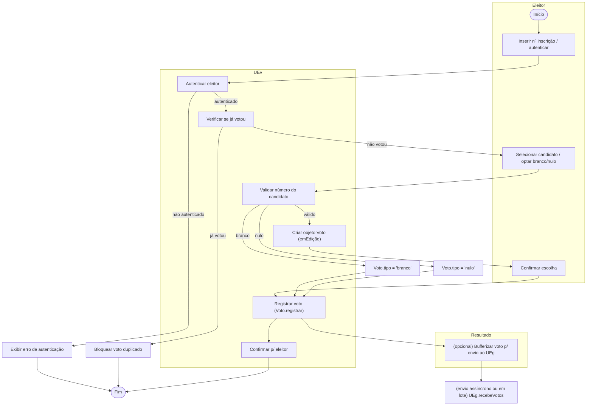

**Descrição:**

* O eleitor se autentica no terminal (UEv).
* Escolhe um candidato ou opta por voto branco/nulo.
* O sistema registra o voto e confirma a operação.

**Observações técnicas:**

* A autenticação deve ser extremamente rápida; a ação de registrar pode ocorrer localmente na UEv e ser enviada ao UEg para agregação.
* O sistema deve garantir **idempotência** e prevenir duplicidade em cenários distribuídos.

---

## UC_03 — Gerenciar Candidatos (Completo com decisão de exclusão)

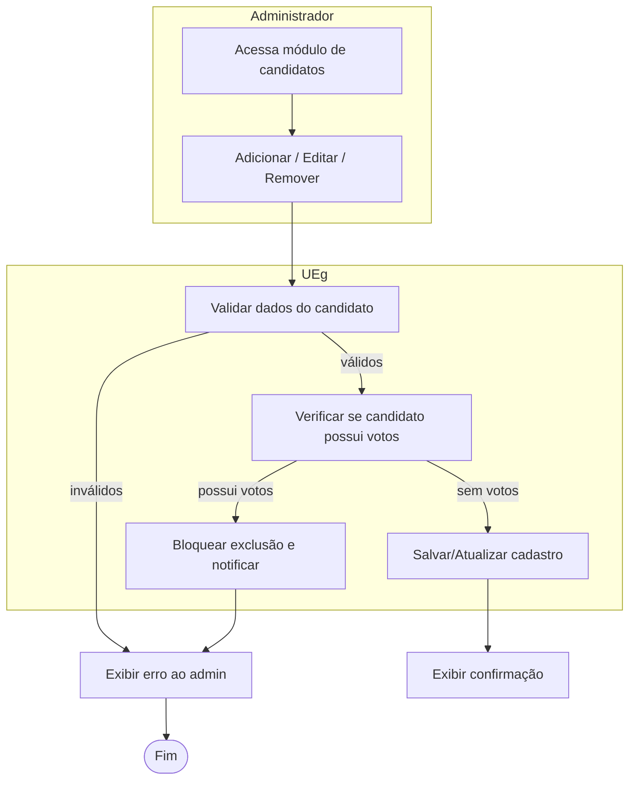
**Descrição:**

* O administrador pode cadastrar, editar ou remover candidatos.
* O sistema realiza a validação dos dados e verifica se o candidato possui votos.
* Se o candidato já tiver votos, sua exclusão é bloqueada.
* 
**Pontos importantes:** exclusão só é permitida quando candidato sem votos; edição é permitida, mas mudanças no número que identifique o candidato podem ser restritas.

---

## UC_04 — Gerenciar Eleitores (Completo com validações e bloqueios)

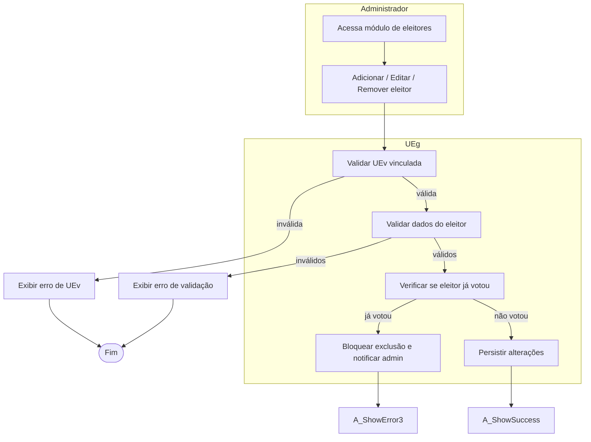
**Descrição:**

* O administrador acessa o módulo de gerenciamento de eleitores.
* A UEv vinculada é validada antes da atualização dos registros.
* O sistema impede a exclusão de eleitores que já tenham votado.

---

## UC_05 — Totalizar Votos (Concorrência: totalizar + gerar relatórios)

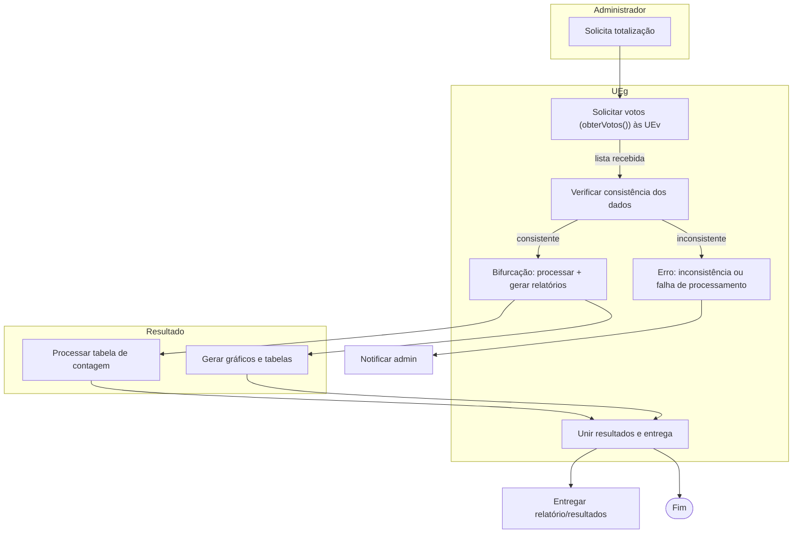

**Descrição:**

* O administrador solicita ao UEg a totalização dos votos.
* O sistema verifica se a lista de votos é consistente.
* Caso positivo, os votos são processados e o relatório é gerado.
* Em caso de inconsistência, uma mensagem de erro é exibida.

**Observação:** bifurcação demonstra execução concorrente de tarefas CPU/IO bound (processamento de contagem e geração de gráficos). A união sincroniza ambas antes da entrega final.

---

## UC_06 — Listar Candidatos (Simples)

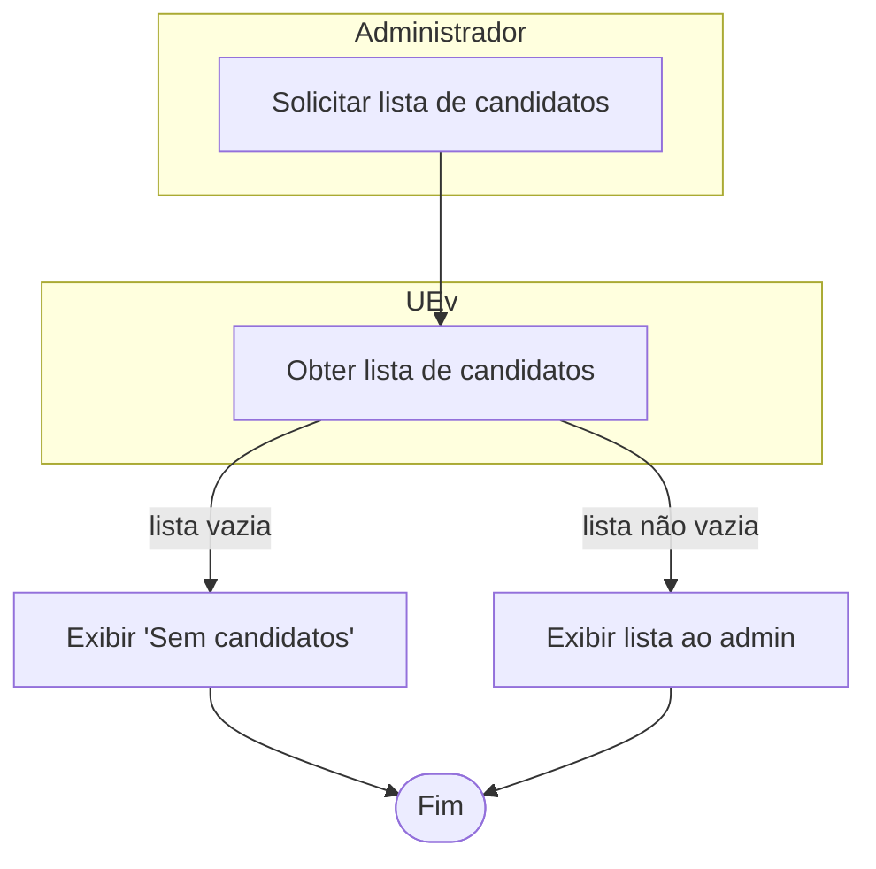
**Descrição:**

* O administrador requisita a listagem de candidatos.
* A UEv retorna os dados e o sistema exibe as informações ou informa que não há candidatos cadastrados.

---

## UC_07 — Listar Eleitores (Simples)

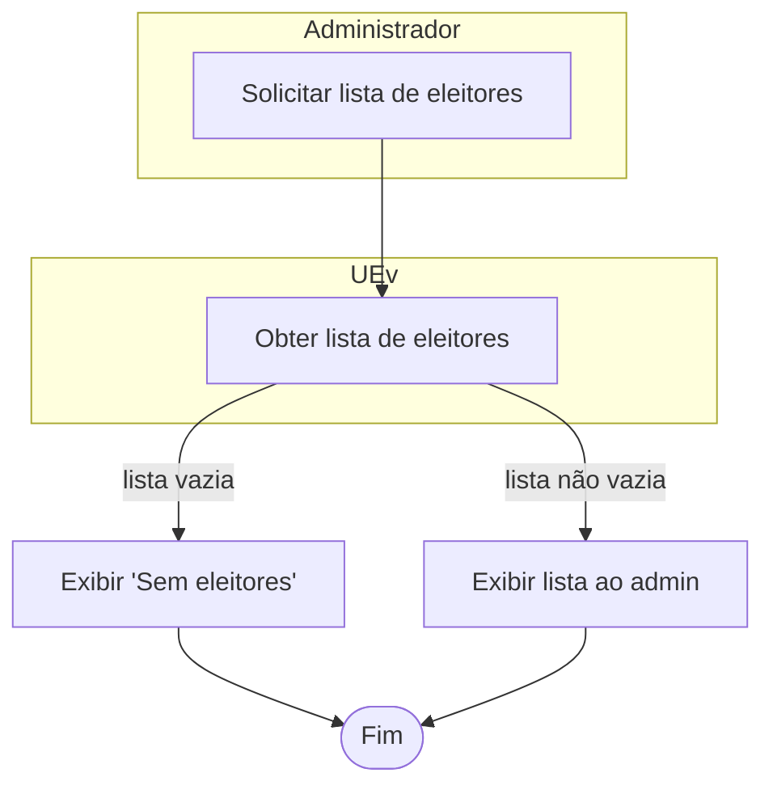
**Descrição:**

* O administrador pode visualizar todos os eleitores cadastrados em uma UEv.
* Caso a lista esteja vazia, o sistema exibe uma mensagem de aviso.

---

## UC_08 — Gerar Relatórios (Detalhado com check de sucesso)

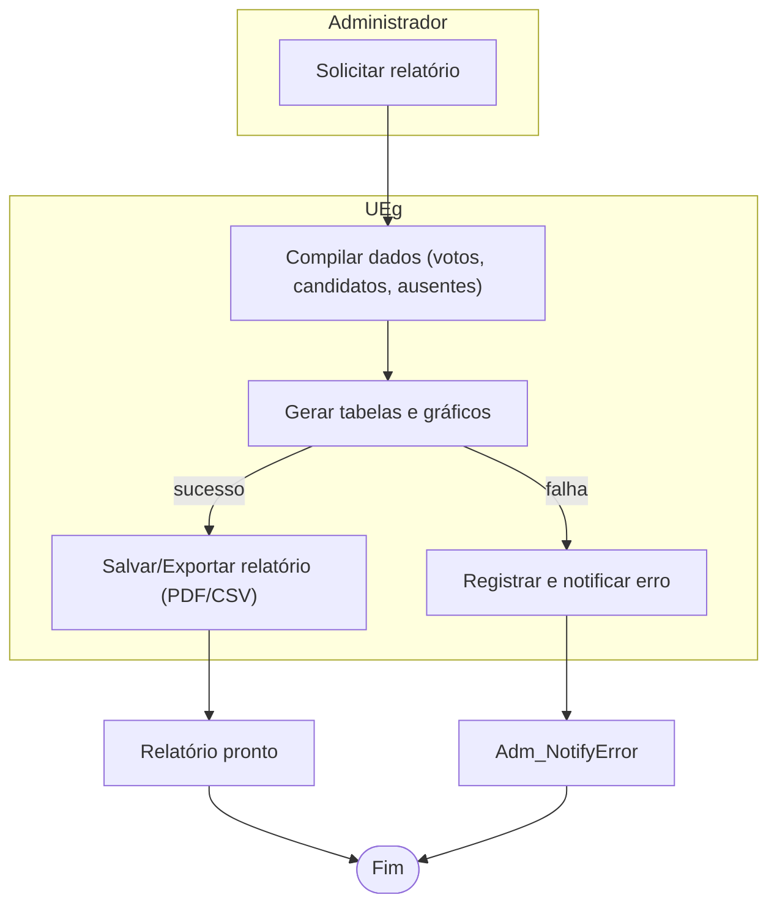
**Descrição:**

* O administrador solicita relatórios de votação e participação.
* O sistema compila dados de candidatos e votos, gerando gráficos e tabelas.
* Caso ocorra erro de geração, o sistema exibe uma mensagem de falha.
---

## UC_09 — Contabilizar Brancos / Nulos / Ausentes (Fluxo detalhado)

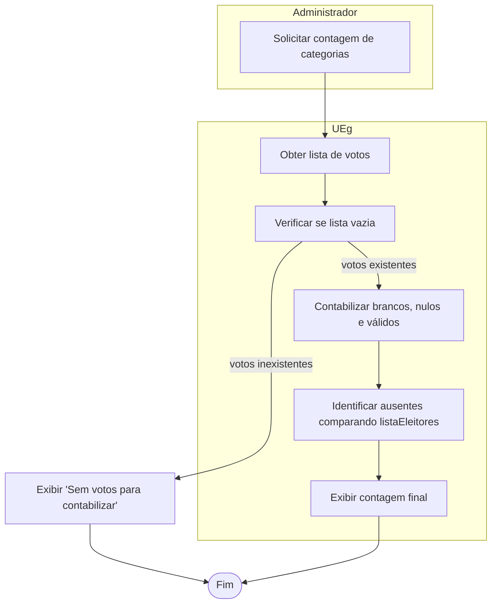
* O sistema contabiliza votos brancos, nulos e identifica eleitores ausentes.
* Caso não haja votos registrados, uma mensagem de aviso é exibida.
---

## UC_10 — Confirmar Número de Inscrição (Eleitor)

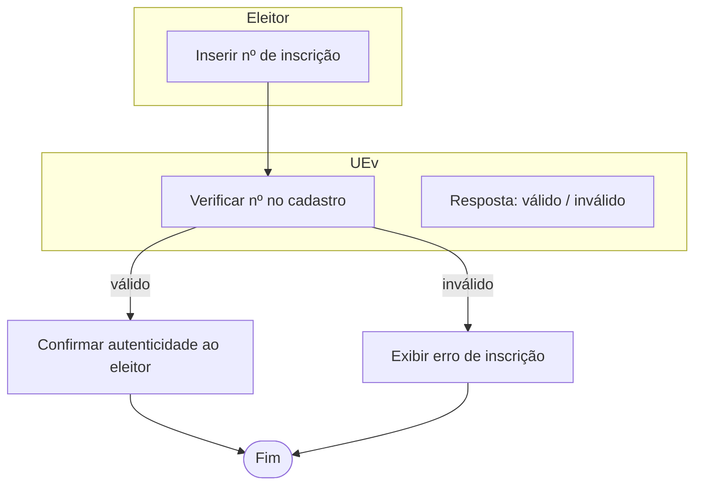
**Descrição:**

* O eleitor insere seu número de inscrição.
* O sistema valida o número e autentica o eleitor.
* Se o número for inválido, é exibida uma mensagem de erro.

---

# 🔎 Observações finais e critérios de entrega

1. **Swimlanes:** cada diagrama identifica claramente o responsável pela ação (Administrador / UEg / UEv / Eleitor / Resultado).
2. **Concorrência:** a totalização demonstra bifurcação e união (processamento paralelo + sincronização).
3. **Decisões e guardas:** todas as decisões críticas possuem guardas (ex.: "autenticado", "inválido", "consistente").
4. **Fluxos de objeto:** onde aplicável, mencionei objetos-chave (listaVotos, relatório, Voto).
5. **Requisitos não-funcionais relevantes:** idempotência no registro de votos; persistência local da UEv; limites por UEg (<=100 UEv).

---

