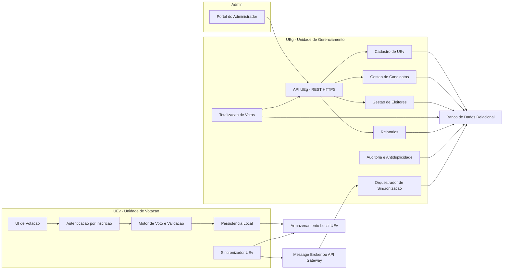
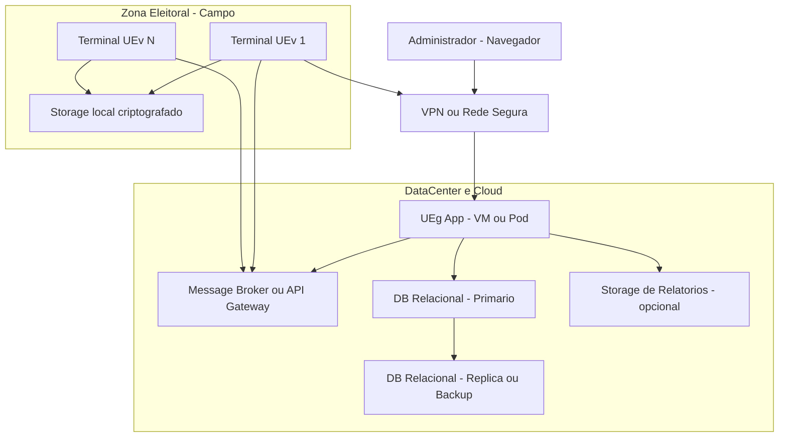

# Diagramas de Componentes e Implantação – Sistema UE (Urna Eletrônica)

Este documento reúne um Diagrama de Componentes e um Diagrama de Implantação para o sistema, com base nos artefatos do projeto (UEv e UEg, casos de uso e requisitos gerais).

## Diagrama de Componentes

### Rastreamento com Casos de Uso

- UC_01 – Cadastrar UEv: ModCadastro (via UEgAPI)
- UC_2 – Votar: UEvUI, UEvAuth, UEvMotor, UEvPersist, UEvSync + ModSync/ModAuditoria (UEg)
- UC_03 – Gerenciar Candidatos: ModCandidatos (via UEgAPI)
- UC_04 – Gerenciar Eleitores: ModEleitores (via UEgAPI)
- UC_05 – Totalizar Votos: ModTotalizacao (leitura de DB) e UEgAPI
- UC_06 – Listar Candidatos: ModCandidatos + UEgAPI
- UC_07 – Listar Eleitores: ModEleitores + UEgAPI
- UC_08 – Gerar Relatórios: ModRelatorios + UEgAPI (usa dados de totalização)
- UC_09 – Contabilizar Brancos/Nulos/Ausentes: ModTotalizacao + ModRelatorios
- UC_10 – Confirmar Número de Inscrição: UEvAuth + UEgAPI/ModEleitores

### Observações

- Dados de candidatos e eleitores são fonte única no UEg/DB e distribuídos às UEv via ModSync.
- UEv opera autonomamente (modo offline) com persistência local e reconciliação assíncrona via Broker.
- Prevenção de voto duplicado: validações locais em UEv e validações de idempotência/auditoria no UEg.
- Suporte a até 8 cargos: parâmetros de eleição replicados para cada UEv.

---

## Diagrama de Implantação

### Notas de Implantação e Requisitos

- Conectividade resiliente: UEv deve operar offline, armazenando localmente e sincronizando quando houver rede (idempotência no servidor para evitar votos duplicados).
- Capacidade: um UEg pode atender até 100 UEv; dimensionar filas (Broker), conexões e banco de dados com partições por UEv/eleição quando necessário.
- Segurança: TLS 1.2+, VPN, hardening dos terminais, armazenamento local criptografado, trilhas de auditoria e assinaturas de pacotes de configuração.
- Consistência de dados: distribuição de candidatos/eleitores e parâmetros (até 8 cargos por UEv) por pacotes versionados; verificação de integridade (hash/assinatura) antes de ativar.
- Observabilidade: métricas e logs por UEv, correlação por eleição, alarmes de falha de sincronização.

---

