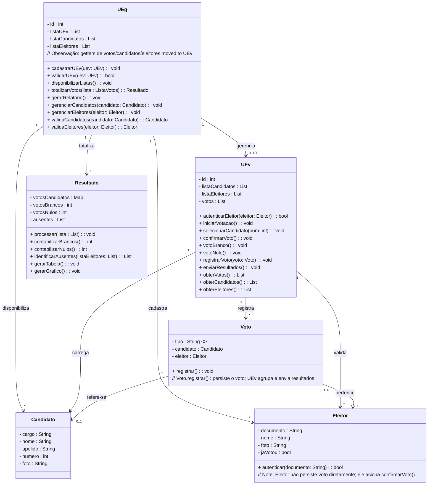

# Diagrama de Classes - Urna Eletrônica

Este documento apresenta o diagrama de classes em **Mermaid** referente ao sistema de **Urna Eletrônica (UE)**, conforme os requisitos do projeto.

## Diagrama de Classes

## Descrição das Classes

### UEg (Unidade de Gerenciamento)
- **Atributos:** id, listaUEv, listaCandidatos, listaEleitores
- **Métodos:** cadastrarUEv(), validarUEv(), disponibilizarListas(), totalizarVotos(), gerarRelatorio()

### UEv (Unidade de Votação)
- **Atributos:** id, listaCandidatos, listaEleitores, votos
- **Métodos:** autenticarEleitor(), iniciarVotacao(), selecionarCandidato(), confirmarVoto(), votoBranco(), votoNulo(), registrarVoto(), enviarResultados(), obterVotos(), obterCandidatos(), obterEleitores()

### Eleitor
- **Atributos:** documento, nome, foto, jaVotou
- **Métodos:** autenticar()

### Candidato
- **Atributos:** cargo, nome, apelido, numero, foto

### Voto
- **Atributos:** tipo, candidato, eleitor
- **Métodos:** registrar()

### Resultado
- **Atributos:** votosCandidatos, votosBrancos, votosNulos, ausentes
- **Métodos:** processar(), contabilizarBrancos(), contabilizarNulos(), identificarAusentes(), gerarTabela(), gerarGrafico()
