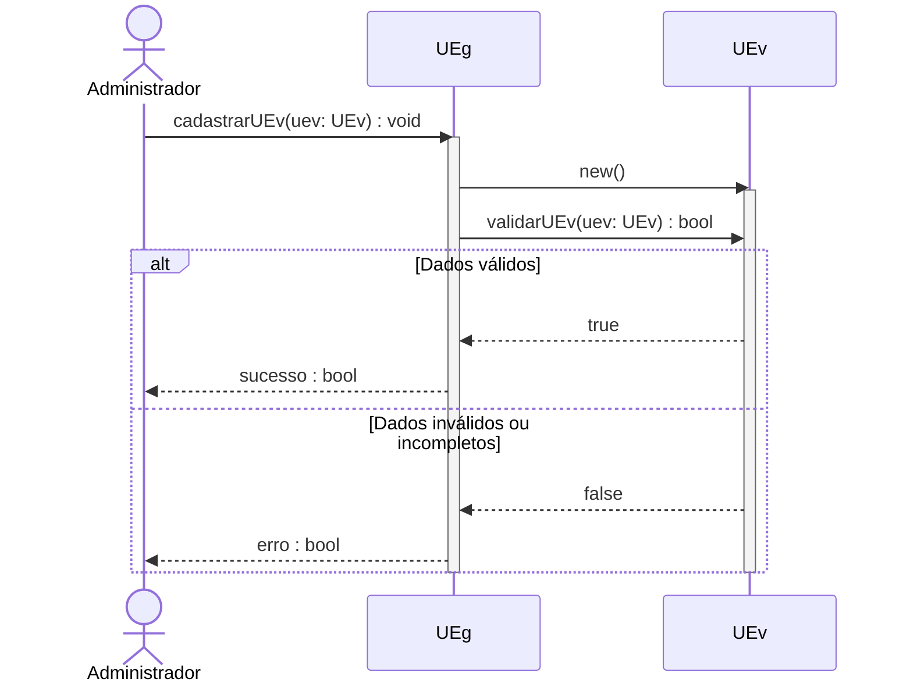
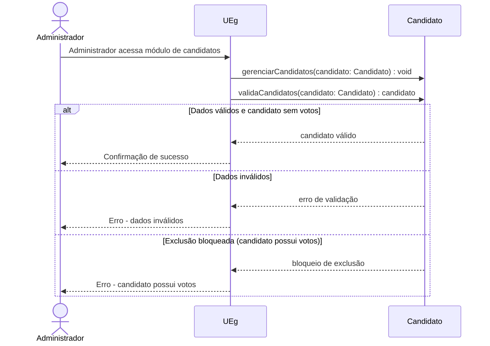
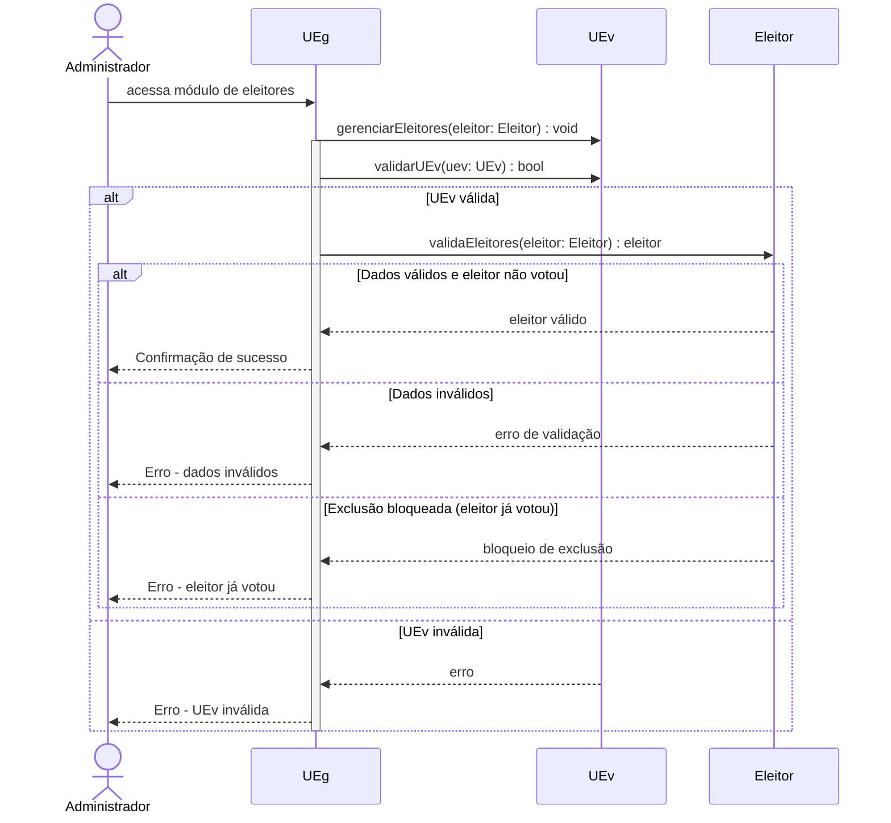
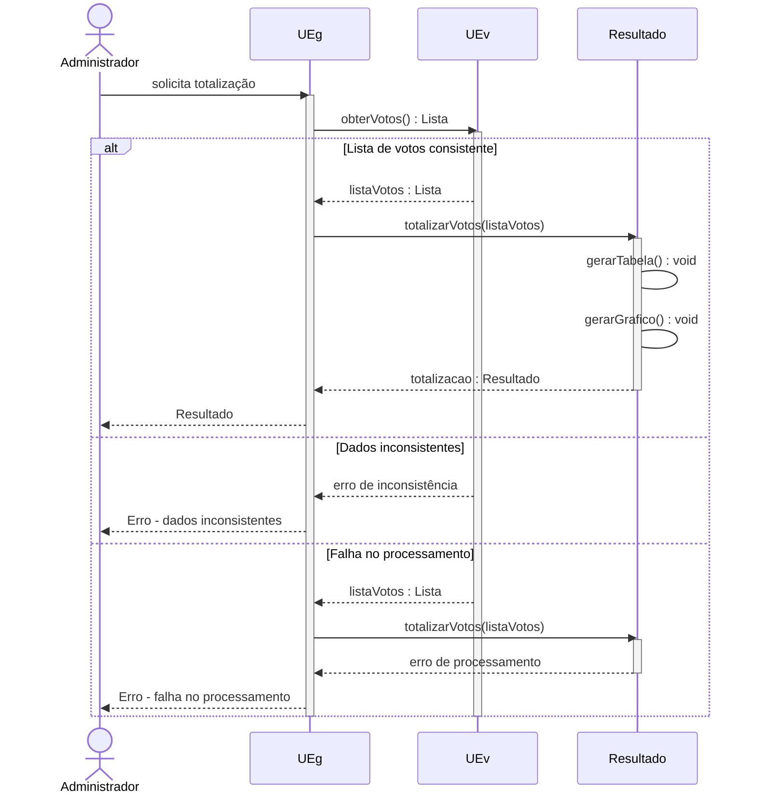
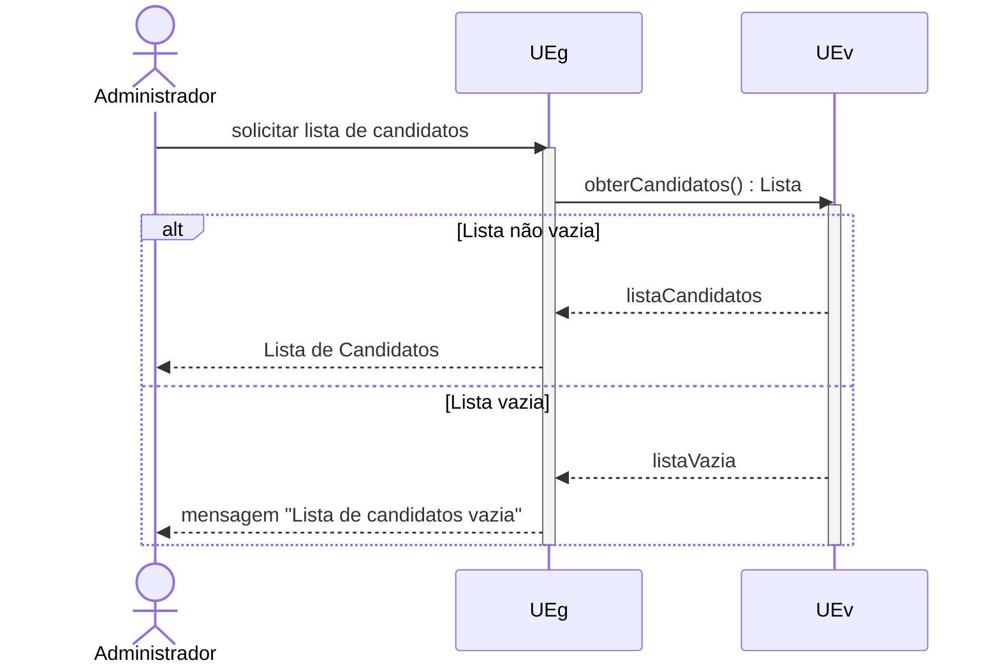
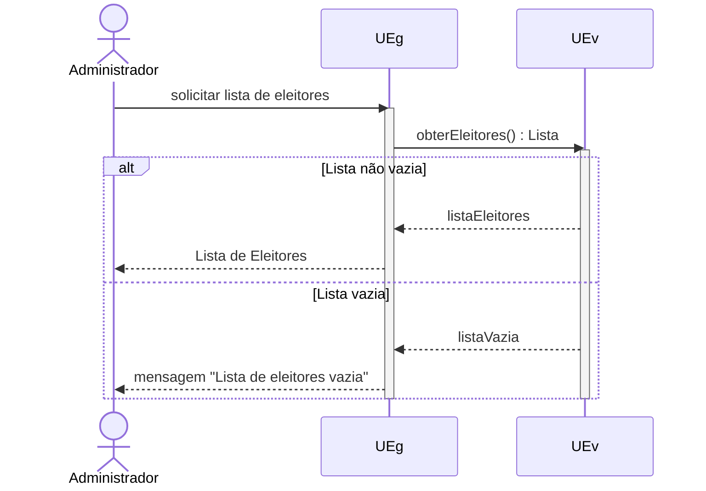

# Diagrama de Sequência – UC_01: Cadastrar UEv

Este diagrama de sequência representa o fluxo principal e o fluxo secundário (dados inválidos ou incompletos) do caso de uso "Cadastrar UEv" do sistema de votação eletrônica.

## Explicação
- O Administrador solicita o cadastro de uma nova UEv ao UEg.
- O UEg instancia a UEv e solicita sua validação.
- Se os dados forem válidos, o fluxo segue normalmente e o administrador recebe confirmação de sucesso.
- Se os dados forem inválidos ou incompletos, o UEg informa o erro ao administrador.
- O diagrama utiliza o bloco `alt` para representar o fluxo alternativo (secundário).

## Diagrama de Sequência – UC_03: Gerenciar Candidatos

Este diagrama de sequência representa o fluxo principal e os fluxos secundários (dados inválidos e exclusão bloqueada) do caso de uso "Gerenciar Candidatos".

### Explicação
- O Administrador acessa o módulo de candidatos no UEg.
- O UEg solicita a operação de gerenciamento e validação ao objeto Candidato.
- Se os dados forem válidos e o candidato não possuir votos, a operação é confirmada.
- Se os dados forem inválidos, o sistema retorna erro de validação.
- Se a exclusão for bloqueada (candidato possui votos), o sistema retorna erro de bloqueio ao administrador.

## Diagrama de Sequência – UC_04: Gerenciar Eleitores

Este diagrama de sequência representa o fluxo principal e os fluxos secundários (dados inválidos, exclusão bloqueada e UEv inválida) do caso de uso "Gerenciar Eleitores".

### Explicação
- O Administrador acessa o módulo de eleitores no UEg.
- O UEg solicita a operação de gerenciamento ao UEv e valida a UEv.
- Se a UEv for válida, o UEg solicita a validação do eleitor.
- Se os dados do eleitor forem válidos e ele não tiver votado, a operação é confirmada.
- Se os dados forem inválidos, o sistema retorna erro de validação.
- Se a exclusão for bloqueada (eleitor já votou), o sistema retorna erro de bloqueio ao administrador.
- Se a UEv for inválida, o sistema retorna erro de UEv inválida ao administrador.

## Diagrama de Sequência – UC_05: Totalizar Votos

Este diagrama de sequência representa o fluxo principal e os fluxos secundários (dados inconsistentes e falha no processamento) do caso de uso "Totalizar Votos".

### Explicação
- O Administrador solicita a totalização ao UEg.
- O UEg solicita a lista de votos à UEv.
- Se a lista de votos estiver consistente, o UEg totaliza os votos e apresenta o resultado ao administrador.
- Se houver dados inconsistentes, o sistema retorna erro de inconsistência.
- Se houver falha no processamento, o sistema retorna erro de processamento ao administrador.

## Diagrama de Sequência – UC_06: Listar Candidatos

Este diagrama de sequência representa o fluxo principal e o fluxo alternativo (lista vazia) do caso de uso "Listar Candidatos".

### Explicação
- O Administrador solicita a lista de candidatos ao UEg.
- O UEg solicita a lista à UEv.
- Se a lista não estiver vazia, o UEg apresenta a lista ao administrador.
- Se a lista estiver vazia, o UEg informa ao administrador que não há candidatos cadastrados.

## Diagrama de Sequência – UC_07: Listar Eleitores

Este diagrama de sequência representa o fluxo principal e o fluxo alternativo (lista vazia) do caso de uso "Listar Eleitores".

### Explicação
- O Administrador solicita a lista de eleitores ao UEg.
- O UEg solicita a lista à UEv.
- Se a lista não estiver vazia, o UEg apresenta a lista ao administrador.
- Se a lista estiver vazia, o UEg informa ao administrador que não há eleitores cadastrados.