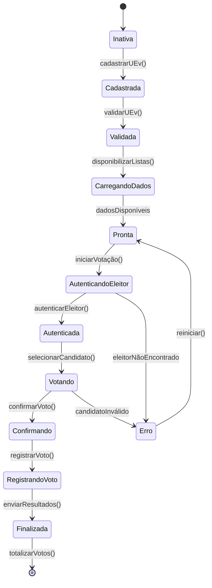
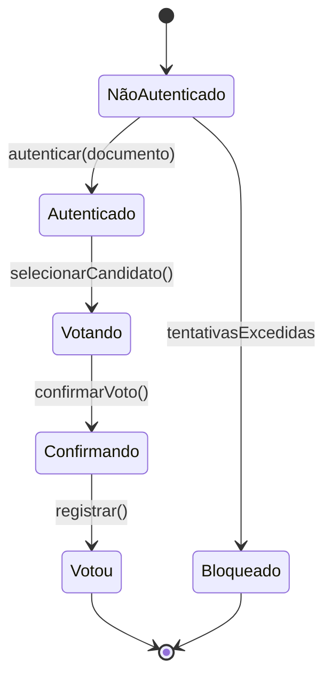
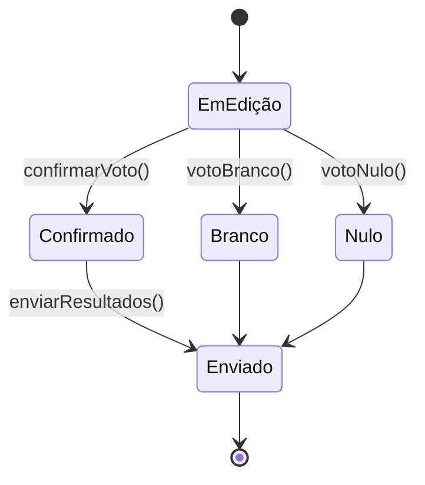
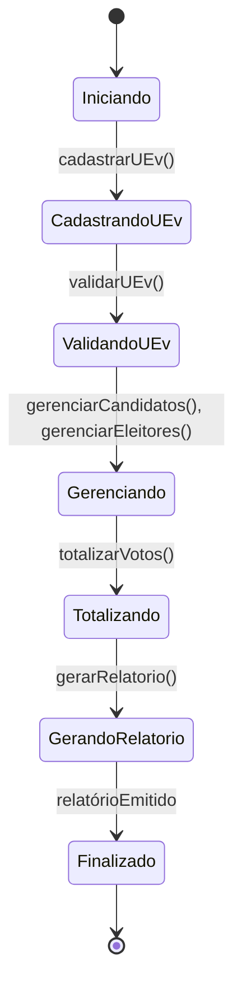

# 📘 Diagramas de Estado – Sistema de Urna Eletrônica

Este documento apresenta os **diagramas de estados** referentes ao projeto da **Urna Eletrônica**, baseados na teoria de modelagem de software orientada a objetos e nos diagramas de sequência desenvolvidos anteriormente.

Cada diagrama representa o comportamento dinâmico de um elemento principal do sistema: **UEv**, **Eleitor**, **Voto** e **UEg**.

---

## 🔹 Diagrama de Estados – UEv (Unidade Eleitoral Virtual)

**Descrição:**

* A *UEv* é inicialmente **inativa**, sendo ativada após o **cadastro e validação**.
* Passa por estados de **preparo**, **autenticação**, **votação** e **registro**.
* Finaliza quando os resultados são **enviados e totalizados**.

---

## 🔹 Diagrama de Estados – Eleitor

**Descrição:**

* O eleitor começa **não autenticado** e precisa se identificar.
* Após autenticação, entra no fluxo de votação e termina em **Votou**, impedindo repetição.
* Exceções são tratadas com o estado **Bloqueado** após falhas sucessivas.

---

## 🔹 Diagrama de Estados – Voto

**Descrição:**

* O voto começa **em edição** enquanto o eleitor faz sua escolha.
* Pode ser **Confirmado**, **Branco** ou **Nulo**, dependendo da ação do eleitor.
* Todos os tipos de voto são **enviados ao sistema** para totalização.

---

## 🔹 Diagrama de Estados – UEg (Unidade de Gerenciamento)

**Descrição:**

* O módulo **UEg** controla o fluxo administrativo do sistema.
* Começa com o cadastro e validação das UEv.
* Passa pelos processos de **gerenciamento**, **totalização** e **geração de relatórios**.
* Encerra no estado **Finalizado**, após o término da eleição.

---

## ✅ Resumo Geral dos Estados

| Entidade    | Estados Principais                                                          | Disparadores                                                                           |
| ----------- | --------------------------------------------------------------------------- | -------------------------------------------------------------------------------------- |
| **UEv**     | Inativa → Validada → Pronta → Autenticada → Finalizada                      | cadastrarUEv(), validarUEv(), autenticarEleitor(), registrarVoto(), enviarResultados() |
| **Eleitor** | NãoAutenticado → Autenticado → Votando → Votou                              | autenticar(), selecionarCandidato(), confirmarVoto()                                   |
| **Voto**    | EmEdição → Confirmado/Branco/Nulo → Enviado                                 | confirmarVoto(), votoBranco(), votoNulo(), enviarResultados()                          |
| **UEg**     | Iniciando → Cadastrando → Validando → Gerenciando → Totalizando → Relatório | cadastrarUEv(), validarUEv(), totalizarVotos(), gerarRelatorio()                       |

---

**Conclusão:**

Esses diagramas de estado complementam os diagramas de sequência, mostrando as possíveis **mudanças de estado ao longo do ciclo de vida** de cada componente. Dessa forma, é possível visualizar tanto o **fluxo de eventos (sequência)** quanto a **reação interna do sistema (estados)**, conforme as boas práticas ensinadas na disciplina de **Modelagem de Software Orientada a Objetos (CC6522)**.
